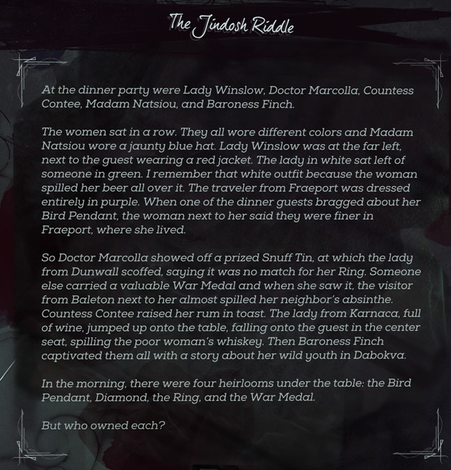

Solution to a "Jindosh riddle" from the game Dishonored 2, using Prolog and Clojure (core.logic).

The primary goal was to solve the actual problem, since in the game one can actually avoid doing a lot of side stuff by just finding the solution to the puzzle (I ended up doing that side stuff anyway... it's a game, you know).

Other goal was to compare the two languages: one that is specifically designed for this kind of stuff, and another - well, Clojure.

The Clojure version does not look too bad (sans a couple of warts, like a need to define a macro for `_`), but the code happens to be quite a bit slower that the Prolog one. I am pretty sure that could have been improved, but I wanted to keep the code as similar as possible between the two languages.

The riddle is just a variation of [Zebra puzzle](https://en.wikipedia.org/wiki/Zebra_Puzzle).

The game does a nice job of randomizing the puzzle for every player (so it is "walkthrough proof"), so this is just one possible instance of it.



### Running Clojure version

```bash
    $ cd clojure
    $ lein run
```

### Running Prolog version

  Used SWI-Prolog 7.2.3:

```bash
    $ cd prolog
    $ prolog -c solution.pro
```
